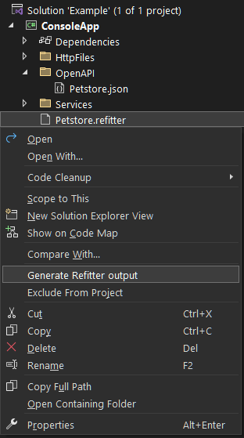
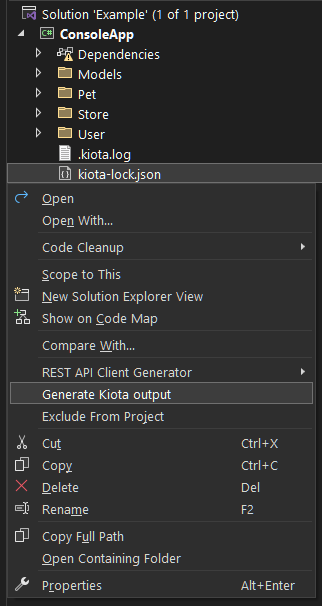
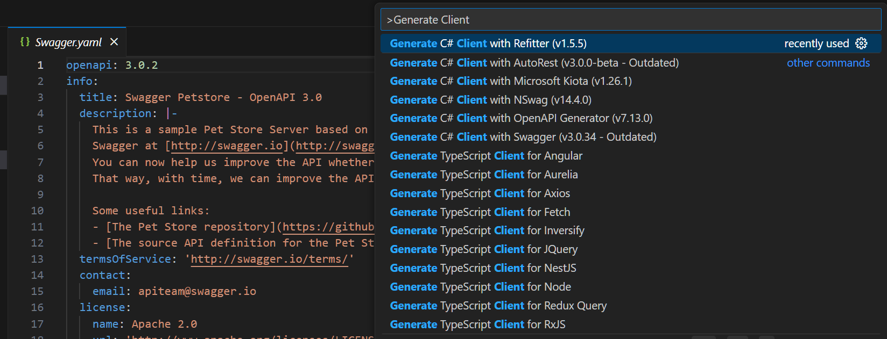
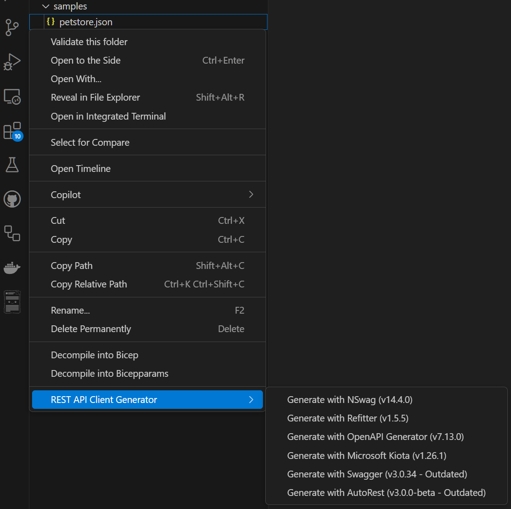
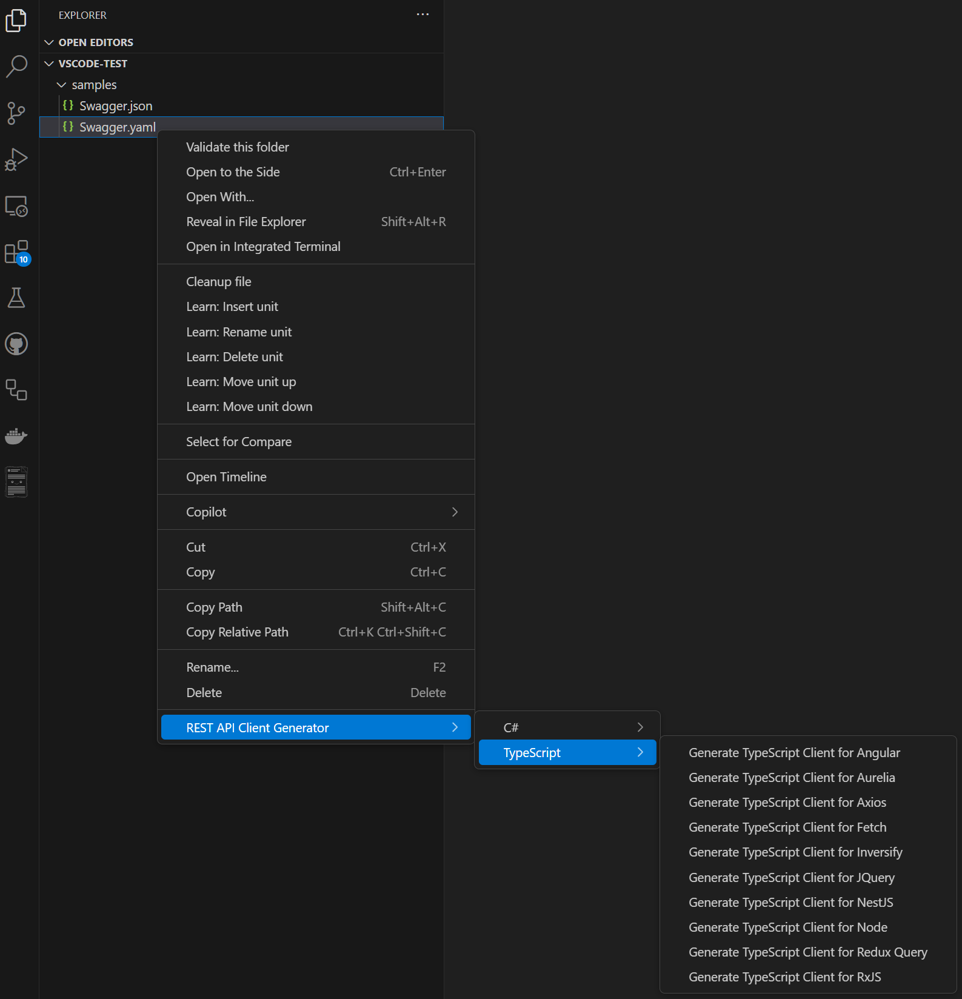

 

 

# REST API Client Code Generator

A collection of Visual Studio C# custom tool code generators for Swagger / OpenAPI specification files

## Download

- **[Visual Studio 2022](https://marketplace.visualstudio.com/items?itemName=ChristianResmaHelle.ApiClientCodeGenerator2022)**
- **[Visual Studio 2019](https://marketplace.visualstudio.com/items?itemName=ChristianResmaHelle.ApiClientCodeGenerator)**
- **[Visual Studio 2017](https://marketplace.visualstudio.com/items?itemName=ChristianResmaHelle.ApiClientCodeGenerator2017)**
- **[Visual Studio Code](https://marketplace.visualstudio.com/items?itemName=ChristianResmaHelle.rest-api-client-code-generator)**
- **[JetBrains Rider](https://github.com/christianhelle/apiclientcodegen/releases/latest)**
- **[Visual Studio for Mac](https://github.com/christianhelle/apiclientcodegen/releases/latest)**. Follow **[these instructions](#visual-studio-for-mac)** for update convenience on Visual Studio for Mac

## Features

- Supports Visual Studio 2017, 2019, 2022, [Visual Studio Code](#visual-studio-code), [JetBrains Rider](#jetbrains-rider), and [Visual Studio for Mac](#visual-studio-for-mac)
- Add New REST API Client to a project from an OpenAPI specification URL (e.g <https://petstore.swagger.io/v2/swagger.json>) using the following code generators:
  - [NSwag](https://github.com/RicoSuter/NSwag)
  - [OpenAPI Generator](https://github.com/OpenAPITools/openapi-generator)
  - [Swagger Codegen](https://github.com/swagger-api/swagger-codegen)
  - [Refitter](https://github.com/christianhelle/refitter)
  - [Microsoft Kiota](https://github.com/microsoft/kiota)
  - [AutoRest](https://github.com/Azure/autorest)
- Define custom namespace for the generated file
- Auto-updating of generated code file when changes are made to the OpenAPI specification JSON or YAML file
- Generate code using a configuration files using the following:
  - `.nswag` configuration files from [NSwagStudio](https://github.com/RicoSuter/NSwag/wiki/NSwagStudio) by including it in the project and using the **Generate NSwag Studio output** context menu
  - `.refitter` settings files from [Refitter](https://github.com/christianhelle/refitter) by including it in the project and using the **Generate Refitter output** context menu
  - `kiota-lock.json` configuration files from [Microsoft Kiota](https://github.com/microsoft/kiota) by including it in the project and using the **Generate Kiota output** context menu

### Custom Tools

Custom tools let you associate a tool with an item in a project and run that tool whenever the file is saved

- ***NSwagCodeGenerator*** - Generates a single file C# REST API Client using the [NSwag.CodeGeneration.CSharp](https://github.com/RSuter/NSwag/wiki/CSharpClientGenerator) [nuget package](https://www.nuget.org/packages/NSwag.CodeGeneration.CSharp/) **v14.4.0**

- ***OpenApiCodeGenerator*** - Generates a single file C# REST API Client using **[OpenAPI Generator v7.13.0](https://github.com/OpenAPITools/openapi-generator/releases/tag/v7.13.0)**.
The output file is the result of merging all the files generated using the OpenAPI Generator tool with:
`generate -g csharp --input-spec [swagger file] --output [output file] -DapiTests=false -DmodelTests=false -DpackageName=[default namespace] --skip-overwrite`. It is possible to configure the OpenAPI Generator to generate multiple files which will be placed at the same path as the OpenAPI specifications document that was used to generate code, this is done under Tools -> REST API Client Code Generator -> OpenAPI Generator and setting **Generate Multiple Files** to **true**

- ***KiotaCodeGenerator*** - Generates a single file C# REST API Client using the Microsoft project **[Kiota v1.26.1](https://learn.microsoft.com/en-us/openapi/kiota/)** generator. The output file is the result of merging all the files generated using the Kiota dotnet tool with: `generate -l CSharp -d [swagger file] -o [output file] -n [default namespace]`. It is possible to configure the OpenAPI Generator to generate multiple files which will be placed at the same path as the OpenAPI specifications document that was used to generate code, this is done under Tools -> REST API Client Code Generator -> Kiota and setting **Generate Multiple Files** to **true`

- ***SwaggerCodeGenerator*** - Generates a single file C# REST API Client using **Swagger Codegen CLI v3.0.34**.
The output file is the result of merging all the files generated using the Swagger Codegen CLI tool with:
`generate -l csharp --input-spec [swagger file] --output [output file] -DapiTests=false -DmodelTests=false -DpackageName=[default namespace] --skip-overwrite`

- ***AutoRestCodeGenerator*** - Generates a single file C# REST API Client using **AutoRest v3.0.0-beta.20210504.2** for OpenAPI v3 and **AutoRest v2.0.4417** for OpenAPI v2. The resulting file is the equivalent of using the AutoRest CLI tool with:
 `--csharp --input-file=[swagger file] --output-file=[output file] --namespace=[default namespace] --add-credentials`

- ***RefitterCodeGenerator*** - Generates a single file C# REST API Client inteface for [Refit](https://github.com/reactiveui/refit) using [Refitter.Core](https://github.com/christianhelle/refitter) [nuget package](https://www.nuget.org/packages/Refitter.Core/) **v1.5.5**.
The output file contains a Refit interface generated by [Refitter](https://github.com/christianhelle/refitter) and contracts generated using [NSwag.CodeGeneration.CSharp](https://github.com/RSuter/NSwag/wiki/CSharpClientGenerator) [nuget package](https://www.nuget.org/packages/NSwag.CodeGeneration.CSharp/)

### Dependencies

The custom tool code generators piggy back on top of well known Open API client code generators like **AutoRest**, **NSwag**, **OpenAPI Generator**, **Microsoft Kiota**, **Refitter**, and **Swagger Codegen CLI**. These tools require [NPM](https://www.npmjs.com/get-npm) and the [Java Runtime Environment](https://java.com/en/download/manual.jsp) to be installed on the developers machine. Alternative Java SDK implementations such as the [OpenJDK](https://adoptopenjdk.net) works fine with this extension. By default, the path to **java.exe** is read from the **JAVA_HOME** environment variable, but is also configurable in the Settings screen. Future versions of the extension will include the [OpenJDK](https://adoptopenjdk.net) in the VSIX package

The **Swagger Codegen CLI** and **OpenAPI Generator** are distributed as JAR files and are downloaded on demand but requires the Java SDK to be installed on the machine. **AutoRest** is installed on-demand via [NPM](https://www.npmjs.com/get-npm) as a global tool and uses the latest available version. **Microsoft Kiota** is installed on-demand as a .NET Tool and requires .NET 7.0. This means that using these custom tools have an initial delay upon first time use. 

**NSwagStudio** is stand alone UI tool for editing a **.nswag** specification file for generating code. This tool is optional to install and official installation instructions are available on the [NSwag Wiki on Github](https://github.com/RicoSuter/NSwag/wiki/NSwagStudio). If **NSwagStudio** is not installed on the machine then the Visual Studio Extension will install the **NSwag CLI** via [NPM](https://www.npmjs.com/get-npm) as a global tool using the latest available version. 

The **NSwag** code generator produces code that depends on the [Newtonsoft.Json](https://www.nuget.org/packages/Newtonsoft.Json/13.0.3) NuGet package

The **Refitter** code generator produces code that depends on the [Refit](https://www.nuget.org/packages/Refit/8.0.0) NuGet package

The **OpenAPI Generator** code generator produces code that depends on the following NuGet packages:

- [RestSharp](https://www.nuget.org/packages/RestSharp/112.0.0)
- [JsonSubTypes](https://www.nuget.org/packages/JsonSubTypes/2.0.1)
- [Polly](https://www.nuget.org/packages/Polly/8.5.2)
- [Newtonsoft.Json](https://www.nuget.org/packages/Newtonsoft.Json/13.0.3)

The project **Kiota** code generator produces code that depends on the following NuGet packages

- [Microsoft.Kiota.Abstractions](https://www.nuget.org/packages/Microsoft.Kiota.Abstractions)
- [Microsoft.Kiota.Http.HttpClientLibrary](https://www.nuget.org/packages/Microsoft.Kiota.Http.HttpClientLibrary)
- [Microsoft.Kiota.Serialization.Form](https://www.nuget.org/packages/Microsoft.Kiota.Serialization.Form)
- [Microsoft.Kiota.Serialization.Text](https://www.nuget.org/packages/Microsoft.Kiota.Serialization.Text)
- [Microsoft.Kiota.Serialization.Json](https://www.nuget.org/packages/Microsoft.Kiota.Serialization.Json)
- [Microsoft.Kiota.Serialization.Multipart](https://www.nuget.org/packages/Microsoft.Kiota.Serialization.Multipart)
- [Microsoft.Kiota.Authentication.Azure](https://www.nuget.org/packages/Microsoft.Kiota.Authentication.Azure)
- [Azure.Identity](https://www.nuget.org/packages/Azure.Identity)

The **Swagger Codegen CLI** code generator produces code that depends on the [RestSharp](https://www.nuget.org/packages/RestSharp/105.1.0) and [JsonSubTypes](https://www.nuget.org/packages/JsonSubTypes/1.9.0) NuGet packages

The **AutoRest** code generator produces code that depends on the [Microsoft.Rest.ClientRuntime](https://www.nuget.org/packages/Microsoft.Rest.ClientRuntime/2.3.24) and [Newtonsoft.Json](https://www.nuget.org/packages/Newtonsoft.Json/13.0.3) NuGet packages

This Visual Studio Extension will automatically add the required NuGet packages that the generated code depends on

## Screenshots

### Settings

This extension will by default make some assumptions on the installation paths for **Java**, **NSwag** and **NPM** but also provides option pages for configuring this. The **Swagger Codegen CLI** and the **OpenAPI Generator** JAR files are by default downloaded to the user TEMP folder but it is also possible to specify to use existing JAR files

Supports customising how AutoRest generates code based on the C# generator settings that the AutoRest CLI tool provides

Supports customising how NSwag generates code using the properties exposed by the NSwag NuGet package

Supports customising how the **.nswag** file is generated using a subset of the options available in NSwag Studio

Supports customising how OpenAPI Generator generates code using the additional optional properties that the OpenAPI Generator CLI tool provides

Supports customising how Refitter generates the Refit interface. This allows you to configure whether to return the type directly or wrap it inside an `IApiResponse<T>`. You can also disable generating contracts or XML doc style comments

Supports allowing Kiota to generate multiple files

This extension collects errors and tracks feature usages to a service called [Exceptionless](https://exceptionless.com) and [Azure Application Insights](https://learn.microsoft.com/en-us/azure/azure-monitor/app/app-insights-overview?WT.mc_id=DT-MVP-5004822). This is done anonymously using a support key and a generated anonymous identity based on a secure hash of username@host

### Visual Studio Code

### MacOS

## Visual Studio Code

The VS Code extension provides similar functionality through a context menu on JSON and YAML files in the explorer. It executes the `rapicgen` .NET tool to generate code, so you will need to have the .NET SDK installed.

### Installation

Download the VSIX file from the [GitHub releases](https://github.com/christianhelle/apiclientcodegen/releases/latest) page, then in VS Code:
1. Go to Extensions view (Ctrl+Shift+X)
2. Click on the "..." menu in the top right corner
3. Select "Install from VSIX..."
4. Select the downloaded .vsix file

### Features

- Context menu on JSON and YAML files for generating code with various generators
- Supports all code generators: NSwag, Refitter, OpenAPI Generator, Microsoft Kiota, Swagger Codegen CLI, and AutoREST
- Configuration options for namespace and output directory

### Usage in VS Code

1. Right-click on a Swagger/OpenAPI specification file (JSON or YAML) in the VS Code explorer
2. Select "REST API Client Code Generator" in the context menu
3. Choose one of the available code generators
4. The generated code will open in the editor

## JetBrains Rider

The JetBrains Rider extension provides similar functionality through a context menu on JSON and YAML files in the explorer. It executes the `rapicgen` .NET tool to generate code, so you will need to have the .NET SDK installed.

### Installation in Rider

Download the plugin from the [GitHub releases](https://github.com/christianhelle/apiclientcodegen/releases/latest) page, then in Rider:

1. Go to Settings > Plugins
2. Click the gear icon and select "Install Plugin from Disk..."
3. Select the downloaded ZIP file

### Rider Features

- Context menu on JSON and YAML files for generating code with various generators
- Supports all code generators: NSwag, Refitter, OpenAPI Generator, Microsoft Kiota, Swagger Codegen CLI, and AutoREST
- Automatic detection of project namespace
- Integration with Rider's solution explorer

### Usage in Rider

1. Right-click on a Swagger/OpenAPI specification file (JSON or YAML) in the Rider solution explorer
2. Select "REST API Client Code Generator" in the context menu
3. Choose one of the available code generators
4. The generated code will be automatically added to your project and opened in the editor

