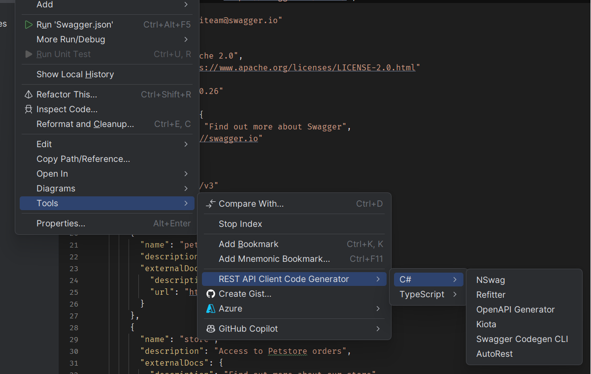
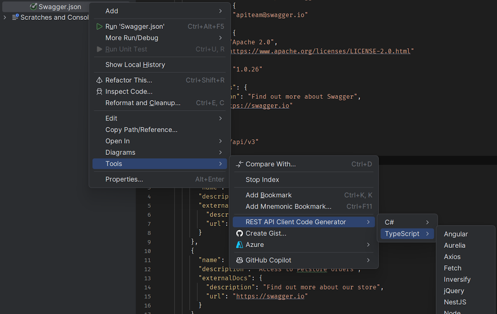
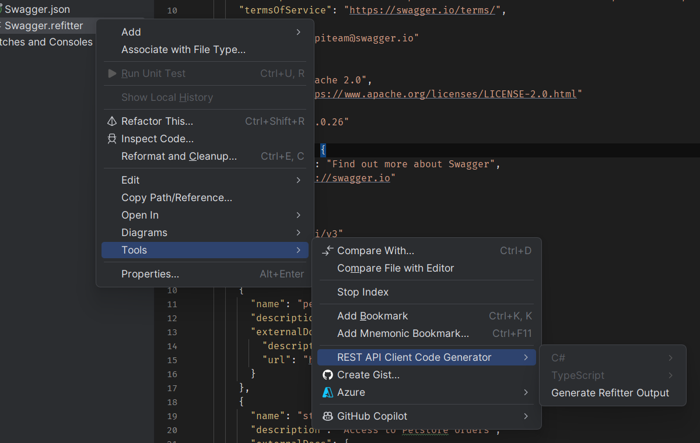

[](https://ci.appveyor.com/project/christianhelle/apiclientcodegen/branch/master)
[](https://github.com/christianhelle/apiclientcodegen/actions/workflows/cli-tool.yml)
[](https://github.com/christianhelle/apiclientcodegen/actions/workflows/vsix.yml)
[](https://github.com/christianhelle/apiclientcodegen/actions/workflows/vscode.yml)


[](https://sonarcloud.io/dashboard?id=christianhelle_apiclientcodegen)
[](https://sonarcloud.io/dashboard?id=christianhelle_apiclientcodegen)
[](https://sonarcloud.io/dashboard?id=christianhelle_apiclientcodegen)
[](https://sonarcloud.io/dashboard?id=christianhelle_apiclientcodegen)
[](https://sonarcloud.io/dashboard?id=christianhelle_apiclientcodegen)
[](https://sonarcloud.io/summary/new_code?id=christianhelle_apiclientcodegen)
[](https://sonarcloud.io/summary/new_code?id=christianhelle_apiclientcodegen)

[](https://marketplace.visualstudio.com/items?itemName=ChristianResmaHelle.APIClientCodeGenerator2022) 
[](https://marketplace.visualstudio.com/items?itemName=ChristianResmaHelle.APIClientCodeGenerator)
[](https://marketplace.visualstudio.com/items?itemName=ChristianResmaHelle.APIClientCodeGenerator)
[](https://marketplace.visualstudio.com/items?itemName=ChristianResmaHelle.APIClientCodeGenerator2022) 
[](https://marketplace.visualstudio.com/items?itemName=ChristianResmaHelle.APIClientCodeGenerator2022)
[](http://www.nuget.org/packages/rapicgen)

[](https://www.buymeacoffee.com/christianhelle)

# REST API Client Code Generator

A collection of Visual Studio C# custom tool code generators for Swagger / OpenAPI specification files

## Download

- **[Visual Studio 2022](https://marketplace.visualstudio.com/items?itemName=ChristianResmaHelle.ApiClientCodeGenerator2022)**
- **[Visual Studio 2019](https://marketplace.visualstudio.com/items?itemName=ChristianResmaHelle.ApiClientCodeGenerator)**
- **[Visual Studio 2017](https://marketplace.visualstudio.com/items?itemName=ChristianResmaHelle.ApiClientCodeGenerator2017)**
- **[Visual Studio Code](https://marketplace.visualstudio.com/items?itemName=ChristianResmaHelle.apiclientcodegen)**
- **[Visual Studio for Mac](#visual-studio-for-mac)**
- **[JetBrains Rider](https://plugins.jetbrains.com/plugin/28472-rest-api-client-code-generator)**

## Features

- Supports Visual Studio 2017, 2019, 2022, 2026, [Visual Studio Code](#visual-studio-code), and [Visual Studio for Mac](#visual-studio-for-mac), and [JetBrains Rider](#intellij-plugin)
- Add New REST API Client to a project from an OpenAPI specification URL (e.g <https://petstore.swagger.io/v2/swagger.json>) using the following code generators:
  - [NSwag](https://github.com/RicoSuter/NSwag)
  - [OpenAPI Generator](https://github.com/OpenAPITools/openapi-generator)
  - [Swagger Codegen](https://github.com/swagger-api/swagger-codegen)
  - [Refitter](https://github.com/christianhelle/refitter)
  - [Microsoft Kiota](https://github.com/microsoft/kiota)
  - [AutoRest](https://github.com/Azure/autorest)
- Define custom namespace for the generated file
- Auto-updating of generated code file when changes are made to the OpenAPI specification JSON or YAML file
- Generate code using a configuration files using the following:
  - `.nswag` configuration files from [NSwagStudio](https://github.com/RicoSuter/NSwag/wiki/NSwagStudio) by including it in the project and using the **Generate NSwag Studio output** context menu
  - `.refitter` settings files from [Refitter](https://github.com/christianhelle/refitter) by including it in the project and using the **Generate Refitter output** context menu
  - `kiota-lock.json` configuration files from [Microsoft Kiota](https://github.com/microsoft/kiota) by including it in the project and using the **Generate Kiota output** context menu

### Custom Tools

Custom tools let you associate a tool with an item in a project and run that tool whenever the file is saved

- ***NSwagCodeGenerator*** - Generates a single file C# REST API Client using the [NSwag.CodeGeneration.CSharp](https://github.com/RSuter/NSwag/wiki/CSharpClientGenerator) [nuget package](https://www.nuget.org/packages/NSwag.CodeGeneration.CSharp/) **v14.4.0**

- ***OpenApiCodeGenerator*** - Generates a single file C# REST API Client using **[OpenAPI Generator v7.16.0](https://github.com/OpenAPITools/openapi-generator/releases/tag/v7.16.0)**.
The output file is the result of merging all the files generated using the OpenAPI Generator tool with:
`generate -g csharp --input-spec [swagger file] --output [output file] -DapiTests=false -DmodelTests=false -DpackageName=[default namespace] --skip-overwrite`. It is possible to configure the OpenAPI Generator to generate multiple files which will be placed at the same path as the OpenAPI specifications document that was used to generate code, this is done under Tools -> REST API Client Code Generator -> OpenAPI Generator and setting **Generate Multiple Files** to **true**

- ***KiotaCodeGenerator*** - Generates a single file C# REST API Client using the Microsoft project **[Kiota v1.28.0](https://learn.microsoft.com/en-us/openapi/kiota/)** generator. The output file is the result of merging all the files generated using the Kiota dotnet tool with: `generate -l CSharp -d [swagger file] -o [output file] -n [default namespace]`. It is possible to configure the OpenAPI Generator to generate multiple files which will be placed at the same path as the OpenAPI specifications document that was used to generate code, this is done under Tools -> REST API Client Code Generator -> Kiota and setting **Generate Multiple Files** to **true**

- ***SwaggerCodeGenerator*** - Generates a single file C# REST API Client using **Swagger Codegen CLI v3.0.34**.
The output file is the result of merging all the files generated using the Swagger Codegen CLI tool with:
`generate -l csharp --input-spec [swagger file] --output [output file] -DapiTests=false -DmodelTests=false -DpackageName=[default namespace] --skip-overwrite`

- ***AutoRestCodeGenerator*** - Generates a single file C# REST API Client using **AutoRest v3.0.0-beta.20210504.2** for OpenAPI v3 and **AutoRest v2.0.4417** for OpenAPI v2. The resulting file is the equivalent of using the AutoRest CLI tool with:
 `--csharp --input-file=[swagger file] --output-file=[output file] --namespace=[default namespace] --add-credentials`

- ***RefitterCodeGenerator*** - Generates a single file C# REST API Client interface for [Refit](https://github.com/reactiveui/refit) using [Refitter.Core](https://github.com/christianhelle/refitter) [nuget package](https://www.nuget.org/packages/Refitter.Core/) **v1.6.3**.
The output file contains a Refit interface generated by [Refitter](https://github.com/christianhelle/refitter) and contracts generated using [NSwag.CodeGeneration.CSharp](https://github.com/RSuter/NSwag/wiki/CSharpClientGenerator) [nuget package](https://www.nuget.org/packages/NSwag.CodeGeneration.CSharp/)

### Dependencies

The custom tool code generators piggy back on top of well known Open API client code generators like **AutoRest**, **NSwag**, **OpenAPI Generator**, **Microsoft Kiota**, **Refitter**, and **Swagger Codegen CLI**. These tools require [NPM](https://www.npmjs.com/get-npm) and the [Java Runtime Environment](https://java.com/en/download/manual.jsp) to be installed on the developers machine. Alternative Java SDK implementations such as the [OpenJDK](https://adoptopenjdk.net) works fine with this extension. By default, the path to **java.exe** is read from the **JAVA_HOME** environment variable, but is also configurable in the Settings screen. Future versions of the extension will include the [OpenJDK](https://adoptopenjdk.net) in the VSIX package

The **Swagger Codegen CLI** and **OpenAPI Generator** are distributed as JAR files and are downloaded on demand but requires the Java SDK to be installed on the machine. **AutoRest** is installed on-demand via [NPM](https://www.npmjs.com/get-npm) as a global tool and uses the latest available version. **Microsoft Kiota** is installed on-demand as a .NET Tool and requires .NET 7.0. This means that using these custom tools have an initial delay upon first time use. 

**NSwagStudio** is stand alone UI tool for editing a **.nswag** specification file for generating code. This tool is optional to install and official installation instructions are available on the [NSwag Wiki on Github](https://github.com/RicoSuter/NSwag/wiki/NSwagStudio). If **NSwagStudio** is not installed on the machine then the Visual Studio Extension will install the **NSwag CLI** via [NPM](https://www.npmjs.com/get-npm) as a global tool using the latest available version. 

The **NSwag** code generator produces code that depends on the [Newtonsoft.Json](https://www.nuget.org/packages/Newtonsoft.Json/13.0.3) NuGet package

The **Refitter** code generator produces code that depends on the [Refit](https://www.nuget.org/packages/Refit/8.0.0) NuGet package

The **OpenAPI Generator** code generator produces code that depends on the following NuGet packages:

- [RestSharp](https://www.nuget.org/packages/RestSharp/112.0.0)
- [JsonSubTypes](https://www.nuget.org/packages/JsonSubTypes/2.0.1)
- [Polly](https://www.nuget.org/packages/Polly/8.6.4)
- [Newtonsoft.Json](https://www.nuget.org/packages/Newtonsoft.Json/13.0.3)

The **Microsoft Kiota** code generator produces code that depends on the following NuGet packages

- [Microsoft.Kiota.Abstractions](https://www.nuget.org/packages/Microsoft.Kiota.Abstractions)
- [Microsoft.Kiota.Http.HttpClientLibrary](https://www.nuget.org/packages/Microsoft.Kiota.Http.HttpClientLibrary)
- [Microsoft.Kiota.Serialization.Form](https://www.nuget.org/packages/Microsoft.Kiota.Serialization.Form)
- [Microsoft.Kiota.Serialization.Text](https://www.nuget.org/packages/Microsoft.Kiota.Serialization.Text)
- [Microsoft.Kiota.Serialization.Json](https://www.nuget.org/packages/Microsoft.Kiota.Serialization.Json)
- [Microsoft.Kiota.Serialization.Multipart](https://www.nuget.org/packages/Microsoft.Kiota.Serialization.Multipart)
- [Microsoft.Kiota.Authentication.Azure](https://www.nuget.org/packages/Microsoft.Kiota.Authentication.Azure)
- [Azure.Identity](https://www.nuget.org/packages/Azure.Identity)

The **Swagger Codegen CLI** code generator produces code that depends on the [RestSharp](https://www.nuget.org/packages/RestSharp/105.2.3) and [JsonSubTypes](https://www.nuget.org/packages/JsonSubTypes/1.9.0) NuGet packages

The **AutoRest** code generator produces code that depends on the [Microsoft.Rest.ClientRuntime](https://www.nuget.org/packages/Microsoft.Rest.ClientRuntime/2.3.24) and [Newtonsoft.Json](https://www.nuget.org/packages/Newtonsoft.Json/13.0.3) NuGet packages

This Visual Studio Extension will automatically add the required NuGet packages that the generated code depends on

## Screenshots


### Settings

This extension will by default make some assumptions on the installation paths for **Java**, **NSwag** and **NPM** but also provides option pages for configuring this. The **Swagger Codegen CLI** and the **OpenAPI Generator** JAR files are by default downloaded to the user TEMP folder but it is also possible to specify to use existing JAR files


Supports customising how AutoRest generates code based on the C# generator settings that the AutoRest CLI tool provides


Supports customising how NSwag generates code using the properties exposed by the NSwag NuGet package


Supports customising how the **.nswag** file is generated using a subset of the options available in NSwag Studio


Supports customising how OpenAPI Generator generates code using the additional optional properties that the OpenAPI Generator CLI tool provides


Supports customising how Refitter generates the Refit interface. This allows you to configure whether to return the type directly or wrap it inside an `IApiResponse<T>`. You can also disable generating contracts or XML doc style comments


Supports allowing Kiota to generate multiple files


This extension collects errors and tracks feature usages to a service called [Exceptionless](https://exceptionless.com) and [Azure Application Insights](https://learn.microsoft.com/en-us/azure/azure-monitor/app/app-insights-overview?WT.mc_id=DT-MVP-5004822). This is done anonymously using a support key and a generated anonymous identity based on a secure hash of username@host


### Visual Studio Code


### MacOS


## Visual Studio Code

The VS Code extension provides similar functionality through a context menu on JSON and YAML files in the explorer. It executes the `rapicgen` .NET tool to generate code, so you will need to have the .NET SDK installed.

### Installation

Download the VSIX file from the [GitHub releases](https://github.com/christianhelle/apiclientcodegen/releases/latest) page, then in VS Code:
1. Go to Extensions view (Ctrl+Shift+X)
2. Click on the "..." menu in the top right corner
3. Select "Install from VSIX..."
4. Select the downloaded .vsix file

### Features

- Context menu on JSON and YAML files for generating code with various generators
- Supports all code generators: NSwag, Refitter, OpenAPI Generator, Microsoft Kiota, Swagger Codegen CLI, and AutoREST
- Configuration options for namespace and output directory

### Usage

1. Right-click on a Swagger/OpenAPI specification file (JSON or YAML) in the VS Code explorer
2. Select "REST API Client Code Generator" in the context menu
3. Choose one of the available code generators
4. The generated code will open in the editor

# Installation

The Visual Studio extension can be installed directly from Visual Studio 2019 and 2022 via the **Extensions Dialog Box**. The process is best described in the official Microsoft documentation for [Managing extensions for Visual Studio](https://docs.microsoft.com/en-us/visualstudio/ide/finding-and-using-visual-studio-extensions?view=vs-2019&WT.mc_id=DT-MVP-5004822)

## Visual Studio for Mac

This installation process for **Visual Studio for Mac** is currently a bit troublesome as the MonoDevelop Addin Repository is currently not accepting new users so I can't really register and setup my extension.

There are 2 ways of installing my extension on Visual Studio for Mac: Adding a custom extension repository or Installing the **.mpack** file directly from the Extensions Manager

### Adding a new extension repository

Here's what you need to do:

- Open the Visual Studio for Mac **Extension Manager**
- You can do this from the menu **Visual Studio** -> **Extentions**


- Select the **Gallery** Tab
- Expand the Repository drop down box and select **Manage Repositories**


- Press on the **Add** button to add a new custom extension repository


- Register an online repository at **https://christianhelle.com/vsmac/main.mrep**
- Click **OK**


- Now my extension repository is added to the list
- Make sure that this is enabled (indicated by a check box)


- You should now be able to see my extensions from the **Gallery** tab


- By adding my extension repository you will be able to conveniently update my extension using the Visual Studio for Mac Extension Manager


### Installing the **.mpack** file directly

Here's what you need to do:
- Download the latest **.mpack file** from the [Latest Github Release](https://github.com/christianhelle/apiclientcodegen/releases/latest)
- Now from within Visual Studio for Mac you need to launch the **Extensions Dialog Box**. You can do this from the menu **Visual Studio** -> **Extensions**


- Click on the **Install from File** button


- Browse to the .mpack file and select it. You will be prompted with a confirmation dialog


- Click **Install** and restart Visual Studio for Mac
- To Verify that the Add-in was installed you can re-open the Extensions Dialog Box, select the **Installed** tab and expand the **IDE Extensions**. You should be able to see the **REST API Client Code Generator**.

- Uninstalling the Add-in is done in this same dialog box by clicking the **Uninstall** button


## IntelliJ Plugin

The IntelliJ plugin provides similar functionality to the VS Code extension through context menus and commands within JetBrains IDEs. It executes the `rapicgen` .NET tool to generate code, so you will need to have the .NET SDK installed.

### IntelliJ Plugin Installation

The plugin is available on the JetBrains Marketplace and can be installed directly from your IDE:

1. Open your JetBrains IDE (IntelliJ IDEA, Rider, WebStorm, etc.)
2. Go to **File** → **Settings** (or **IntelliJ IDEA** → **Preferences** on macOS)
3. Navigate to **Plugins**
4. Search for "REST API Client Code Generator"
5. Click **Install** and restart your IDE

Alternatively, you can install it from the [JetBrains Marketplace](https://plugins.jetbrains.com/plugin/28472-rest-api-client-code-generator).

### IntelliJ Plugin Features

- Context menu on JSON and YAML files for generating code with various generators
- Supports all code generators: NSwag, Refitter, OpenAPI Generator, Microsoft Kiota, Swagger Codegen CLI, and AutoREST
- Multiple language support: C#, TypeScript, and more
- Configuration options for namespace and output directory
- Integration with JetBrains project structure

### IntelliJ Plugin Usage

1. Right-click on a Swagger/OpenAPI specification file (JSON or YAML) in the project explorer
2. Select "Generate REST API Client" from the context menu
3. Choose your preferred code generator and target language
4. Configure the namespace and output options
5. The generated code will be added to your project

### IntelliJ Plugin Screenshots







## Cross Platform Command Line Tool

All custom tools mentioned above are also implemented in a cross platform command line application.

### Requirements

- .NET 6.0 runtime
- Java Runtime Environment
- NPM

### CLI Installation

The tool can be installed as a .NET Core global tool that you can call from the shell / command line

```bash
dotnet tool install --global rapicgen
```

or by following the instructions [here](https://www.nuget.org/packages/rapicgen) to install a specific version of tool

### CLI Usage

Since the tool is published as a .NET Core Tool, it can be launched from anywhere using any command line interface by calling **rapicgen**.
The help information is displayed when not specifying any arguments to **rapicgen**

```
Usage: rapicgen [command] [options]

Options:
  -v|--verbose       Show verbose output
  -?|-h|--help       Show help information.

Commands:
  csharp             Generate C# API clients
  jmeter             Generate Apache JMeter test plans
  openapi-generator  Generate code using OpenAPI Generator (v7.16.0).
                     See supported generators at https://openapi-generator.tech/docs/generators/
  typescript         Generate TypeScript API clients

Run 'rapicgen [command] -?|-h|--help' for more information about a command.
```

Some help information is also provided per command and can be launched by 

```
rapicgen [command name] -?
```

or

```
rapicgen [command name] [sub command name] -?
```

For example:

```
rapicgen csharp -?
``` 

will output this:

```
Generate C# API clients

Usage: rapicgen csharp [command] [options]

Options:
  -?|-h|--help  Show help information.

Commands:
  autorest      AutoRest (v3.0.0-beta.20210504.2)
  kiota         Microsoft Kiota (v1.28.0)
  nswag         NSwag (v14.4.0)
  openapi       OpenAPI Generator (v7.16.0)
  refitter      Refitter (v1.6.3)
  swagger       Swagger Codegen CLI (v3.0.34)

Run 'csharp [command] -?|-h|--help' for more information about a command.

```

and

```
rapicgen csharp autorest -?
```

will output this:

```
Generate Swagger / Open API client using AutoRest

Usage: run autorest [options] <swaggerFile> <namespace> <outputFile>

Arguments:
  swaggerFile   Path to the Swagger / Open API specification file
  namespace     Default namespace to in the generated code
  outputFile    Output filename to write the generated code to. Default is the swaggerFile .cs

Options:
  -?|-h|--help  Show help information
```

or 

```
rapicgen typescript -?
```

will output this:

```
Generate TypeScript API client

Usage: rapicgen typescript [options] <generator> <swaggerFile> <outputPath>

Arguments:
  generator         The tech stack to use for the generated client library
                    Allowed values are: Angular, Aurelia, Axios, Fetch, Inversify, JQuery, NestJS, Node, ReduxQuery,
                    Rxjs.
                    Default value is: Angular.
  swaggerFile       Path to the Swagger / Open API specification file
  outputPath        Output folder to write the generated code to
                    Default value is: typescript-generated-code.

Options:
  -nl|--no-logging  Disables Analytics and Error Reporting
  -?|-h|--help      Show help information.
```

## Usage Examples:

Let's say we have a OpenAPI Specifications document called **Swagger.json**

For starters, we can use the Swagger Petstore spec. Here's an example powershell script for downloading it

```
Invoke-WebRequest -Uri https://petstore.swagger.io/v3/swagger.json -OutFile Swagger.json
```

In case you don't have the CLI tool installed you can install it by

```
dotnet tool install --global rapicgen
```

Here's an example of how to generate code using **AutoRest**

```
rapicgen csharp autorest Swagger.json GeneratedCode ./AutoRestOutput.cs
```

Here's an example of how to generate code using **Kiota**

```
rapicgen csharp kiota Swagger.json GeneratedCode ./OpenApiOutput.cs
```

Here's an example of how to generate code using **NSwag**

```
rapicgen csharp nswag Swagger.json GeneratedCode ./NSwagOutput.cs
```

Here's an example of how to generate code using **Swagger Codegen CLI**

```
rapicgen csharp swagger Swagger.json GeneratedCode ./SwaggerOutput.cs
```

Here's an example of how to generate code using **OpenAPI Generator**

```
rapicgen csharp openapi Swagger.json GeneratedCode ./OpenApiOutput.cs
```

Here's an example of how to generate code **JMeter** test plans

```
rapicgen jmeter Swagger.json
```

Here's an example of how to generate code for **TypeScript**

```
rapicgen typescript Angular Swagger.json
```

#

For tips and tricks on software development, check out [my blog](https://christianhelle.com)

If you find this useful and feel a bit generous then feel free to [buy me a coffee ☕](https://www.buymeacoffee.com/christianhelle)

